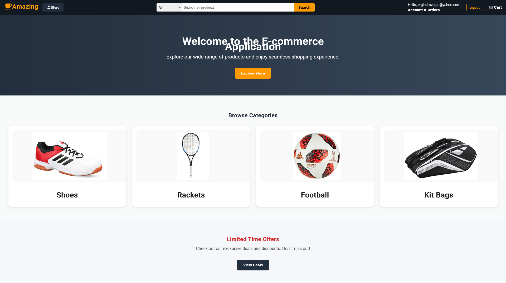
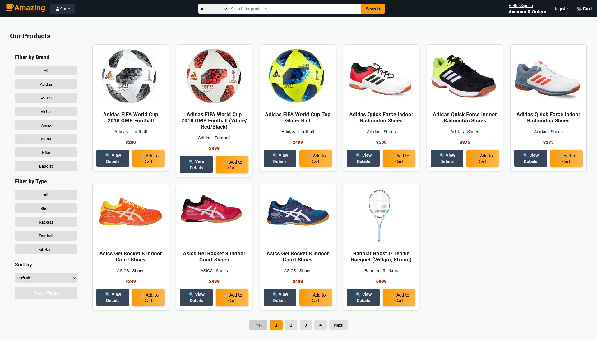
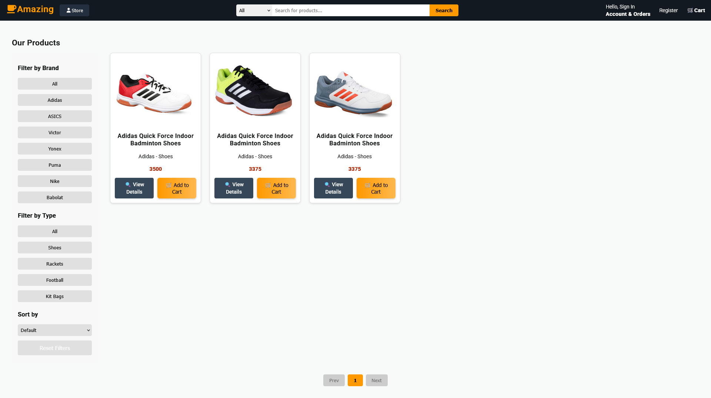
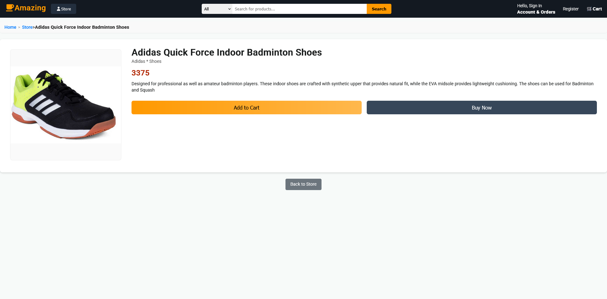
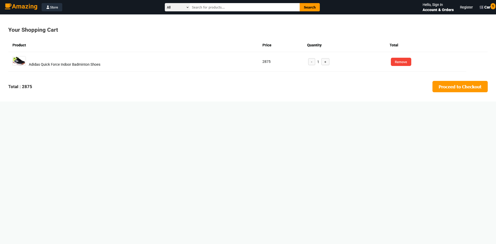
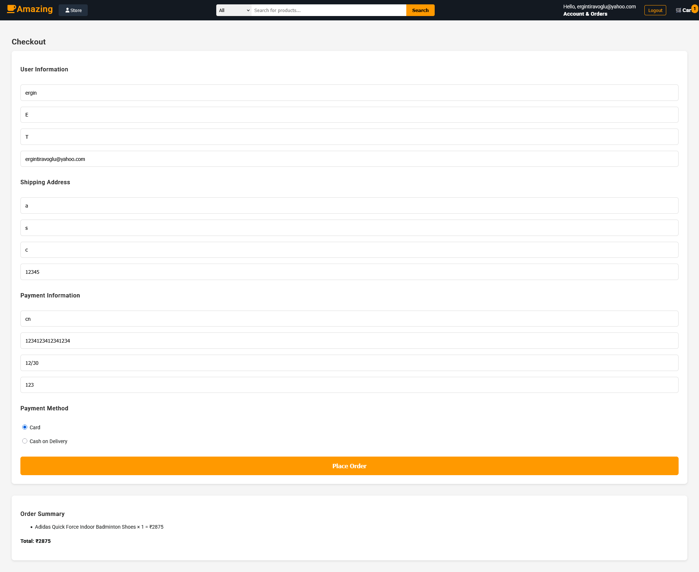
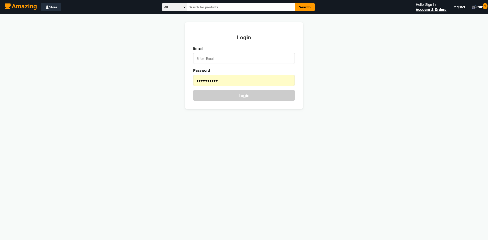
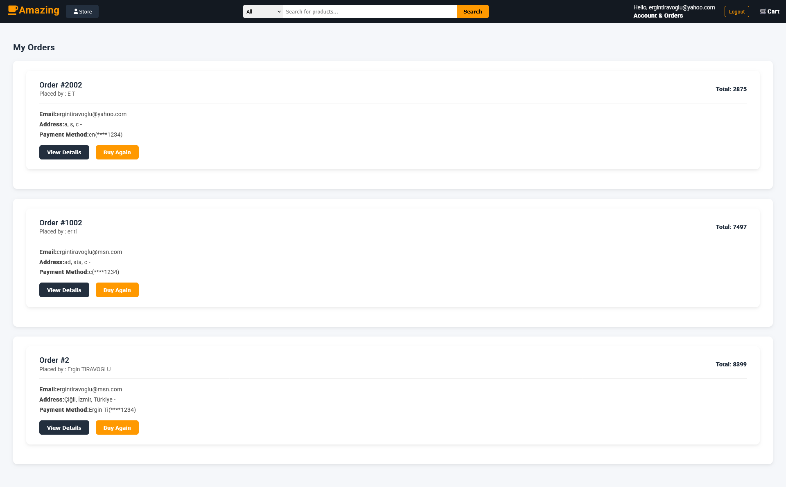
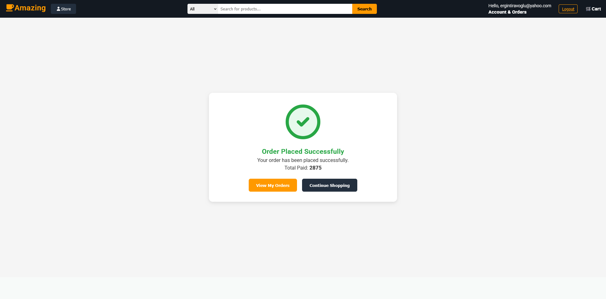

## 🚀 E-Commerce Microservices Project

This project is a full-stack microservices-based e-commerce system built with modern technologies and best practices.

It demonstrates:

*   Scalable microservice architecture
*   Event-driven communication
*   Clean Architecture + CQRS pattern
*   Containerized development with Docker

## 🧠 Architecture Overview
*   Microservices Architecture
*   CQRS + MediatR
*   Event-driven communication (RabbitMQ + MassTransit)
*   API Gateway (Ocelot)
*   Centralized Logging (Serilog + Elasticsearch + Kibana)

## 🧩 All Service List

*   Catalog (Products)    
*   Basket (Carts)    
*   Discount (Coupons)
*   OrderService (Checkout)
*   Payment (Payment)-(Simulated)
*   Identity (Authentication and Authorization)
*   Api Gateway (Ocelot)
*   Client-Frontend (Angular)<br><br>

*   Logging (Serilog)
*   Docker Servers (MongoDB, Redis, PostgreSql, Mssql, RabbitMQ, Elasticsearch, Kibana)
   
# 🐳 Docker Servers

*   MongoDB -> docker run -d -p 27017:27017 --name mongodb-server -e MONGO_INITDB_ROOT_USERNAME="admin" -e MONGO_INITDB_ROOT_PASSWORD="pass1234567" mongo
*   Redis -> docker run -d --name redis-server -p 6379:6379 redis
*   PostgreSql -> docker run --name discount-postgres -e POSTGRES_USER=postgres -e POSTGRES_PASSWORD=123456 -e POSTGRES_DB=DiscountDb -p 5432:5432 -d postgres
*   Mssql (Order) -> docker run -e "ACCEPT_EULA=Y" -e "SA_PASSWORD=Password100" -p 1433:1433 --name order-sqlserver -d mcr.microsoft.com/mssql/server:2022-latest
*   Mssql (Identity) -> docker run -e "ACCEPT_EULA=Y" -e "SA_PASSWORD=Password100" -p 1434:1433 --name identitydb -d mcr.microsoft.com/mssql/server:2022-latest
*   RabbitMQ -> docker run -d --hostname rabbitmq-host --name rabbitmq -p 5672:5672 -p 15672:15672 -e RABBITMQ_DEFAULT_USER=guest -e RABBITMQ_DEFAULT_PASS=guest rabbitmq:3-management
*   Elasticsearch -> docker run -d --name elasticsearch -p 9200:9200 -p 9300:9300 -e "discovery.type=single-node" -e "xpack.security.enabled=false" docker.elastic.co/elasticsearch/elasticsearch:8.14.3
*   Kibana -> docker run -d --name kibana --link elasticsearch:elasticsearch -p 5601:5601 -e "ELASTICSEARCH_HOSTS=http://elasticsearch:9200" docker.elastic.co/kibana/kibana:8.14.3

## ⚡Docker Quick Start
### Run all services with Docker
``` 
docker-compose -f .\docker-compose.yml -f .\docker-compose.override.yml up -d --build 
```

### Stop services
```
   docker-compose down
```


### 📦 Catalog Service :

*   MediatR    
*   MongoDB    
*   Swagger
    

### 🛒 Basket Service :

*   MediatR    
*   Redis    
*   Swagger
*   Grpc - (Client)
*   MassTransit
*   RabbitMQ (Publisher/Producer)
    

### 🎟️ Discount Service :

*   MediatR    
*   PostgreSql    
*   Dapper    
*   Grpc - (Server)


### 📦 Order Service :

*   MediatR
*   Mssql Server
*   Entity Framework Core
*   Fluent Validation (with a custom validator)
*   Swagger
*   MassTransit
*   RabbitMQ (Subscriber/Consumer)

### 💳 Payment Service (Simulated) :

*   MassTransit
*   RabbitMQ (Subscriber/Consumer)
*   Swagger

### 🔐 Identity Service :

*   Mssql Server
*   Entity Framework Core
*   ASP .NET Core Identity
*   JWT Authentication
*   Swagger

### 🌐 API Gateway (Ocelot) :

*   Ocelot

### 📊 Logging (Serilog) :

*   Serilog
*   Elasticsearch
*   Kibana

## 📸 Screenshots

### Architecture Diagram (ChatGPT)


### Home Page


### Store Page


### Filtered Store Page


### Product Details Page


### Shopping Cart Page


### Checkout Page


### Login Page


### Orders Page


### Order Completed Page


